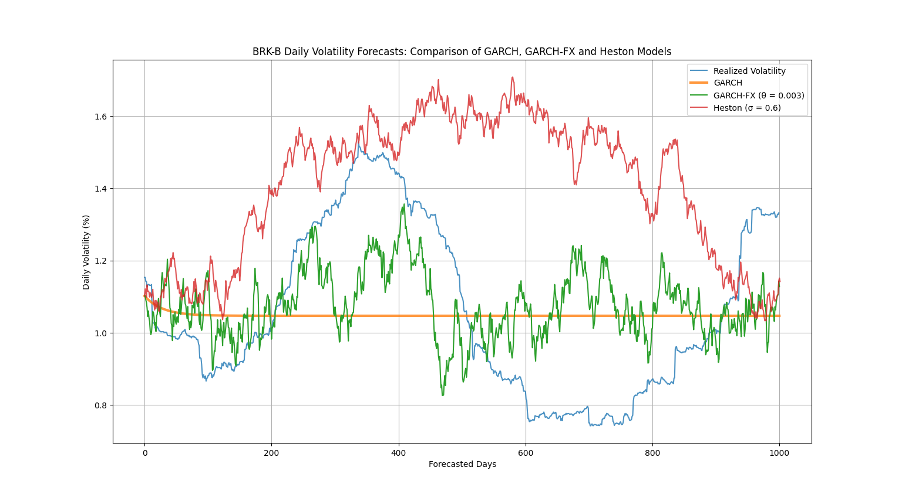
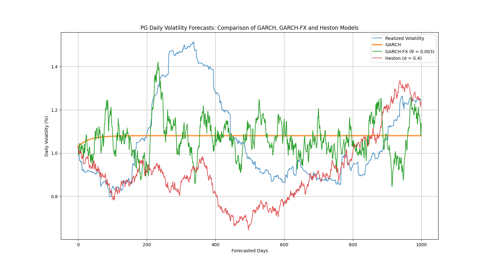
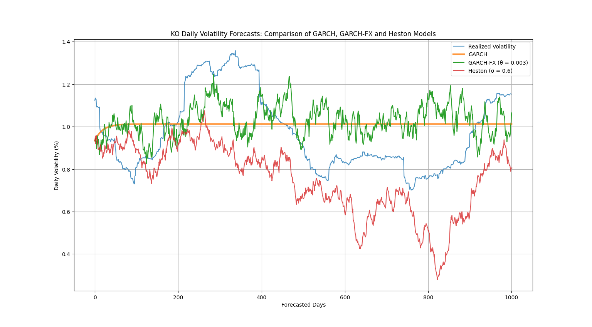

# GARCH-FX

A stochastic, regime-aware extension of traditional GARCH volatility forecasting.

---

## Overview 

**GARCH-FX**, or GARCH Forecasting eXtension, is an experimental and novel augmentation of the classic **GARCH(1,1)** model. While traditional GARCH models are robust, they often struggle to accurately capture the jagged, noisy behavior of realized volatility over longer horizons. This is because GARCH forecasts for long-term volatility tend to flatline, driven by parameters $$(\alpha, \beta, \omega)$$ that are trained on a specific historical window. Even though traditional GARCH models excel at precisely modeling the long-term mean variance (or average volatility) within that training period, their predictive power for extended future periods can be limited by this inherent smoothing.

GARCH-FX fills this gap by injecting **stochastic behavior** and dynamic **regime-switching** into volatility forecasts. It introduces structural enhancements to better reflect the uncertain nature of real-world volatility, mimicking market disorder with controlled randomness and regime shifts. This model isn't a replacement for GARCH; rather, it's a framework-level extension that respects GARCH mechanics but adds a stochastic engine and regime context for more flexible, adaptive forecasting. By leveraging the precisely trained parameters from GARCH, GARCH-FX forecasts volatility stochastically and in a regime-aware manner. This makes it particularly useful in applications requiring more dynamic and realistic long-term volatility projections, such as stress-testing, Monte Carlo simulations, or synthetic market generation.

---

## The GARCH-FX Evolution: From Static to Stochastic Volatility

This section outlines the foundational equations that highlight the unique contribution of GARCH-FX in volatility forecasting.

### 1. Traditional GARCH(1,1) Model

The GARCH(1,1) model is fundamental for modeling conditional variance. It suggests that today's variance depends on yesterday's squared returns and yesterday's variance.

$$
\sigma_t^2 = \omega + \alpha \epsilon_{t-1}^2 + \beta \sigma_{t-1}^2
$$

* $\sigma_t^2$: Conditional variance at time $t$
* $\omega$: Constant term
* $\alpha$: Weight given to the previous period's squared error (news about volatility)
* $\epsilon_{t-1}^2$: Squared error from the previous period (actual return minus expected return)
* $\beta$: Weight given to the previous period's forecast variance (persistence of volatility)
* $\sigma_{t-1}^2$: Conditional variance from the previous period

---

### 2. Traditional GARCH Long-Term Forecast

When forecasting GARCH(1,1) over longer horizons, the conditional variance tends to revert to its long-run mean, often resulting in a "flatlining" effect. This occurs because the forecast recursively depends on the previous period's variance, causing the impact of new information to diminish over time.

$$
\sigma_{t+k}^2 = \omega + (\alpha + \beta) \cdot \sigma_{t+k-1}^2
$$ 

Where $(k > 1)$

* $\sigma_{t+k}^2$: Forecasted conditional variance $k$ periods into the future.
* This equation shows how the forecast for the next period primarily depends on a constant $\omega$ and a decaying influence from the previous period's forecasted variance $\sigma_{t+k-1}^2$, scaled by $(\alpha + \beta)$. As $k$ increases, the forecast stabilizes towards the long-run mean.


---


### 3. GARCH-FX Enhanced Forecast

GARCH-FX extends the traditional GARCH forecast by incorporating **stochastic components** and **dynamic regime-switching mechanics**. This allows for non-flatlining, more dynamic volatility paths that better reflect the jagged, uncertain nature of real-world market behavior.

The core of the GARCH-FX forecast injects regime awareness via a multiplier variable and a stochastically driven component (modeled by a Gamma distribution), fundamentally deviating from the deterministic recursion of traditional GARCH:

$$
\sigma_{t+k}^2 = \omega \cdot \Delta_{S_{t+k}} + (\alpha + \beta) \cdot \bar{\sigma}_{t+k-1}^2
$$

Where:

$$
\bar{\sigma}\_{t+k-1}^2 \sim \Gamma \left(\frac{\sigma_{t+k-1}^2}{\theta} + 1, \theta \right)
$$

* $\sigma_{t+k}^2$: GARCH-FX forecasted conditional variance $k$ periods into the future. 
* $\omega$, $\alpha$, $\beta$: Parameters inherited from the underlying GARCH(1,1) model.
* $\Delta_{S_{t+k}}$: A **regime multiplier** at time $t+k$, capturing discrete shifts in volatility levels.
* $\bar{\sigma}_{t+k-1}^2$: A **stochastic variance** at time $t+k$ derived from a Gamma distribution.
* $\theta_t$: The **scale** of the Gamma distribution that also influences the "volatility of volatility".

This framework ensures that while GARCH-FX respects the foundational GARCH mechanics, it introduces the necessary randomness and structural shifts for more realistic and adaptive long-term volatility projections.

---

## Benchmarks

GARCH-FX was benchmarked against Realized Volatility, vanilla GARCH and Heston.

### 1. Berkshire Hathaway Inc Class B

```shell
Enter Ticker: BRK-B
Enable Regime Shifting (Y/N): y
RMSE (GARCH-FX to Realized Volatility): 0.24490
RMSE (Heston to Realized Volatility): 0.26849
```



### 2. Procter & Gamble Co

```shell
Enter Ticker: PG
Enable Regime Shifting (Y/N): y
RMSE (GARCH-FX to Realized Volatility): 0.20961
RMSE (Heston to Realized Volatility): 0.27516
```



### 3. Coca-Cola Co

```shell
Enter Ticker: KO
Enable Regime Shifting (Y/N): y
RMSE (GARCH-FX to Realized Volatility): 0.21125
RMSE (Heston to Realized Volatility): 0.39119
```



---

## Note

GARCH-FX is experimental and should not be used for high-stakes production trading. Instead, it serves as a research playground for modeling volatility in a more expressive and intuitive manner.
