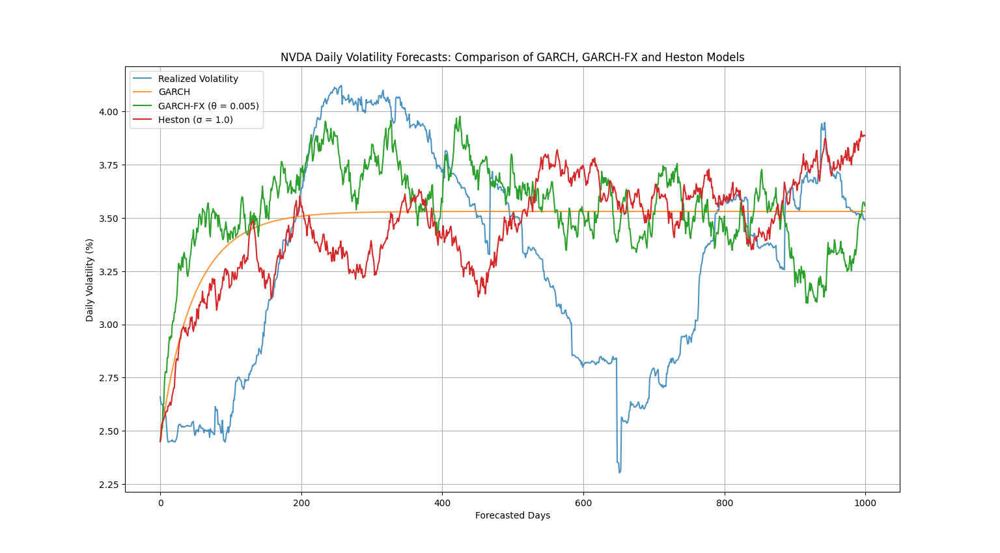
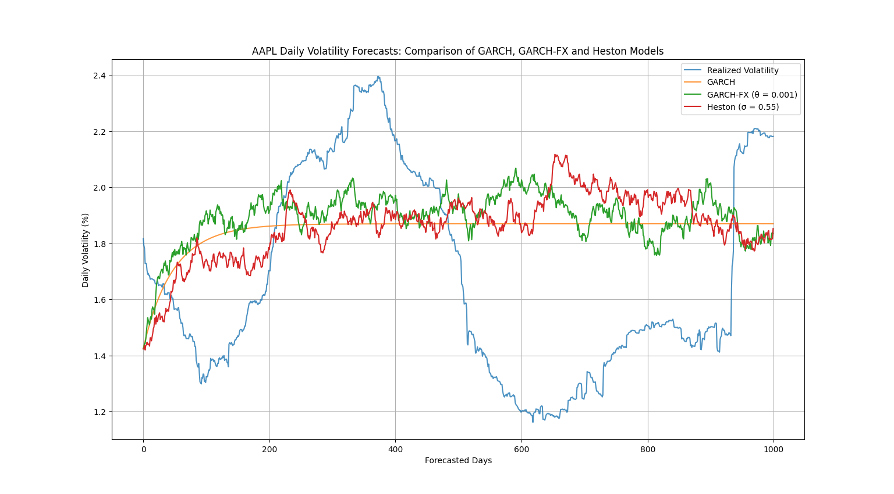
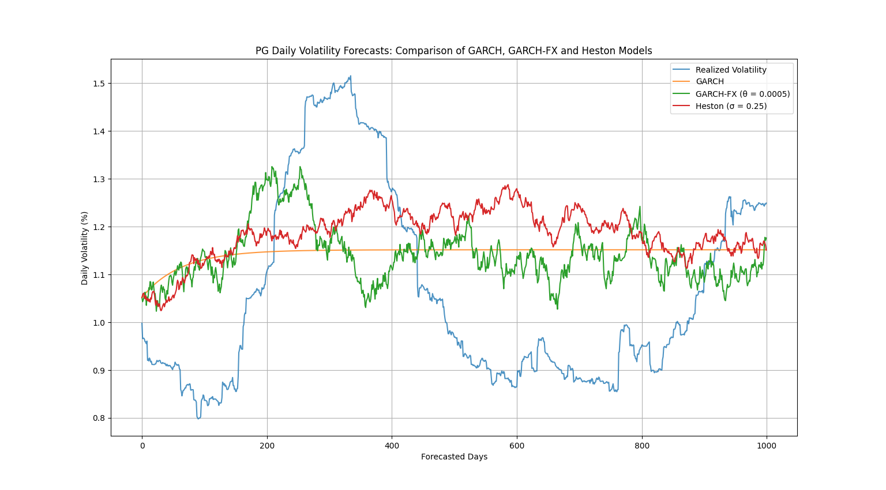

# GARCH-FX

A stochastic, regime-aware extension of traditional GARCH volatility forecasting.

---

Refer to the preprints for deeper insights and benchmarks.

[MPRA](https://mpra.ub.uni-muenchen.de/125321/)

---

## Overview 

**GARCH-FX**, or GARCH Forecasting eXtension, is an experimental and novel augmentation of the classic **GARCH(1,1)** model. While traditional GARCH models are robust, they often struggle to accurately capture the jagged, noisy behavior of realized volatility over longer horizons. This is because GARCH forecasts for long-term volatility tend to flatline, driven by parameters $$(\alpha, \beta, \omega)$$ that are trained on a specific historical window. Even though traditional GARCH models excel at precisely modeling the long-term mean variance (or average volatility) within that training period, their predictive power for extended future periods can be limited by this inherent smoothing.

GARCH-FX fills this gap by injecting **stochastic behavior** and dynamic **regime-switching** into volatility forecasts. It introduces structural enhancements to better reflect the uncertain nature of real-world volatility, mimicking market disorder with controlled randomness and regime shifts. This model isn't a replacement for GARCH; rather, it's a framework-level extension that respects GARCH mechanics but adds a stochastic engine and regime context for more flexible, adaptive forecasting. By leveraging the precisely trained parameters from GARCH, GARCH-FX forecasts volatility stochastically and in a regime-aware manner. This makes it particularly useful in applications requiring more dynamic and realistic long-term volatility projections, such as stress-testing, Monte Carlo simulations, or synthetic market generation.

---

## The GARCH-FX Evolution: From Static to Stochastic Volatility

This section outlines the foundational equations that highlight the unique contribution of GARCH-FX in volatility forecasting.

### 1. Traditional GARCH(1,1) Model

The GARCH(1,1) model is fundamental for modeling conditional variance. It suggests that today's variance depends on yesterday's squared returns and yesterday's variance.

$$
\sigma_t^2 = \omega + \alpha \epsilon_{t-1}^2 + \beta \sigma_{t-1}^2
$$

* $\sigma_t^2$: Conditional variance at time $t$
* $\omega$: Constant term
* $\alpha$: Weight given to the previous period's squared error (news about volatility)
* $\epsilon_{t-1}^2$: Squared error from the previous period (actual return minus expected return)
* $\beta$: Weight given to the previous period's forecast variance (persistence of volatility)
* $\sigma_{t-1}^2$: Conditional variance from the previous period

---

### 2. Traditional GARCH Long-Term Forecast

When forecasting GARCH(1,1) over longer horizons, the conditional variance tends to revert to its long-run mean, often resulting in a "flatlining" effect. This occurs because the forecast recursively depends on the previous period's variance, causing the impact of new information to diminish over time.

$$
\sigma_{t+k}^2 = \omega + (\alpha + \beta) \cdot \sigma_{t+k-1}^2
$$ 

Where $(k > 1)$

* $\sigma_{t+k}^2$: Forecasted conditional variance $k$ periods into the future.
* This equation shows how the forecast for the next period primarily depends on a constant $\omega$ and a decaying influence from the previous period's forecasted variance $\sigma_{t+k-1}^2$, scaled by $(\alpha + \beta)$. As $k$ increases, the forecast stabilizes towards the long-run mean.


---


### 3. GARCH-FX Enhanced Forecast

GARCH-FX extends the traditional GARCH forecast by incorporating **stochastic components** and **dynamic regime-switching mechanics**. This allows for non-flatlining, more dynamic volatility paths that better reflect the jagged, uncertain nature of real-world market behavior.

The core of the GARCH-FX forecast injects regime awareness via a multiplier variable and a stochastically driven component (modeled by a Gamma distribution), fundamentally deviating from the deterministic recursion of traditional GARCH:

$$
\sigma_{t+k}^2 = \omega \cdot \Delta_{S_{t+k}} + (\alpha + \beta) \cdot \bar{\sigma}_{t+k-1}^2
$$

Where:

$$
\bar{\sigma}\_{t+k-1}^2 \sim \Gamma \left(\frac{\sigma_{t+k-1}^2}{\theta} + 1, \theta \right)
$$

* $\sigma_{t+k}^2$: GARCH-FX forecasted conditional variance $k$ periods into the future. 
* $\omega$, $\alpha$, $\beta$: Parameters inherited from the underlying GARCH(1,1) model.
* $\Delta_{S_{t+k}}$: A **regime multiplier** at time $t+k$, capturing discrete shifts in volatility levels.
* $\bar{\sigma}_{t+k-1}^2$: A **stochastic variance** at time $t+k$ derived from a Gamma distribution.
* $\theta_t$: The **scale** of the Gamma distribution that also influences the "volatility of volatility".

This framework ensures that while GARCH-FX respects the foundational GARCH mechanics, it introduces the necessary randomness and structural shifts for more realistic and adaptive long-term volatility projections.

---

# Installation

This guide will walk you through setting up the project on your local machine.

## Prerequisites

Before you begin, ensure you have the following installed:

* **Git**: For cloning the repository.
* **Python 3**: The project is built with Python. It's recommended to use Python 3.8 or newer.

## Getting Started

1.  **Clone or Download the Repository:**
    You can obtain the project files by either cloning the repository using Git or downloading a ZIP archive.

    * **Using Git (Recommended):**
        ```bash
        git clone https://github.com/nitintonypaul/GARCH-FX.git
        ```

    * **Downloading a ZIP:**
        Go to the GitHub repository page, click the green "Code" button, and select "Download ZIP." Unzip the downloaded file to your desired location.

2.  **Navigate to the Project Directory:**
    Open your terminal or command prompt and change your current directory to the newly cloned or unzipped project folder.

    ```bash
    cd GARCH-FX
    ```

3.  **Install Dependencies:**
    It's highly recommended to use a **virtual environment** to manage project dependencies. This prevents conflicts with other Python projects on your system.

    * **Create a virtual environment (if you don't have one):**
        ```bash
        python -m venv venv
        ```
    * **Activate the virtual environment:**
        * **On macOS/Linux:**
            ```bash
            source venv/bin/activate
            ```
        * **On Windows:**
            ```bash
            .\venv\Scripts\activate
            ```
    * **Install the required packages:**
        ```bash
        pip install -r requirements.txt
        ```

## Running the Project

Once the dependencies are installed, you can either run a backtest or use the forecasting model.

### Running a Backtest

To run a backtest using the `test.py` script:

```bash
python test.py
```

### Running the Forecasting Model

To run the forecasting model using the `main.py` script, you'll need to provide several arguments.

#### Arguments for `main.py`:

* `--ticker <TICKER_SYMBOL>`: **(Required)** The stock ticker symbol for which to perform the forecast (e.g., `AAPL`, `MSFT`).
* `--train <TRAINING_PERIOD_DAYS>`: **(Required)** The model training period in days (e.g., `1000` or above is recommended).
* `--horizon <FORECAST_HORIZON_DAYS>`: **(Required)** The model forecast horizon in days (e.g., `30`).
* `--theta <VALUE>`: (Optional) The theta variable for forecasting. Defaults to `1e-3`. Higher values increases jaggedness of the forecast.
* `--garchcomp`: (Optional) If included, the model will compare with a standard GARCH model. Defaults to `True`.
* `--reg`: (Optional) Enables regime switching. Defaults to `False`.
* `--customreg`: (Optional) If included, allows you to enter a custom regime matrix and regime state values. Defaults to `False`.
* `--help`: To display help.

#### Example Usage:

Here's an example of how to run the `main.py` script:

```bash
python main.py --ticker MSFT --train 1000 --horizon 60 --theta 0.005 --reg
```

This command would forecast `MSFT`'s movement, training on 1000 days of data and forecasting 60 days into the future, with a custom theta value and enabling both GARCH comparison and regime switching.

## Benchmarks

GARCH-FX was benchmarked against Realized Volatility, vanilla GARCH and Heston.

### 1. NVIDIA Corp

```shell
Enter Ticker: NVDA
Enable Regime Shifting (Y/N): N
Enter Vol of Vol. (Heston): 1

GARCH-FX Parameters:
Omega  0.229856
Alpha  0.049683
Beta   0.931876

Model          RMSE     MAE      Mean Vol.
GARCH          0.47978  0.38978  3.477%
Heston         0.52634  0.43119  3.461%
GARCH-FX       0.51101  0.42174  3.544%
Realized Vol.  -        -        3.320%
```



### 2. Apple Inc

```shell
Enter Ticker: AAPL
Enable Regime Shifting (Y/N): N
Enter Vol of Vol. (Heston): 0.55

GARCH-FX Parameters:
Omega  0.0665797
Alpha  0.0651289
Beta   0.915837

Model          RMSE     MAE      Mean Vol.
GARCH          0.40359  0.36471  1.848%
Heston         0.44048  0.38695  1.863%
GARCH-FX       0.43658  0.38485  1.894%
Realized Vol.  -        -        1.675%
```



### 3. Procter & Gamble Co

```shell
Enter Ticker: PG
Enable Regime Shifting (Y/N): N
Enter Vol of Vol. (Heston): 0.25

GARCH-FX Parameters:
Omega  0.0203721
Alpha  0.0334487
Beta   0.951174

Model          RMSE     MAE      Mean Vol.
GARCH          0.21603  0.19726  1.145%
Heston         0.23264  0.20866  1.185%
GARCH-FX       0.21310  0.19427  1.140%
Realized Vol.  -        -        1.062%
```



---

## Note

GARCH-FX is experimental and should not be used for high-stakes production trading. Instead, it serves as a research playground for modeling volatility in a more expressive and intuitive manner.
